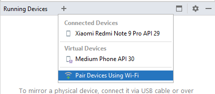
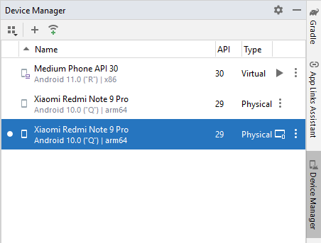

# ADB

Подключение устройств для отладки

## AVD

## Wi-fi

Для устройств >= Android 11 можно подключаться по qr коду из Android Studio



Для более ранних версий работает схема: [kotlin - Running wifi adb on android 10 device - Stack Overflow](https://stackoverflow.com/questions/74681846/running-wifi-adb-on-android-10-device)

В cmd открываем папку 

```
C:\Users\GSench>D:

D:>cd D:\Programing\Android\AndroidSDK\platform-tools

D:\Programing\Android\AndroidSDK\platform-tools>adb devices
List of devices attached
3aefa4fc        device
emulator-5554   device

D:\Programing\Android\AndroidSDK\platform-tools>adb tcpip 5555
error: more than one device/emulator
```

Оставляем подключенным только телефон, эмулятор вырубаем

```
D:\Programing\Android\AndroidSDK\platform-tools>adb devices
List of devices attached
3aefa4fc        device

D:\Programing\Android\AndroidSDK\platform-tools>adb tcpip 5555
restarting in TCP mode port: 5555
```

Смотрим локальный IP адрес телефона в настройках wifi

```
D:\Programing\Android\AndroidSDK\platform-tools>adb connect 192.168.100.65:5555
connected to 192.168.100.65:5555

D:\Programing\Android\AndroidSDK\platform-tools>adb devices
List of devices attached
3aefa4fc        device
192.168.100.65:5555     device
```

Готово! Устройство появляется в списке ADB:


