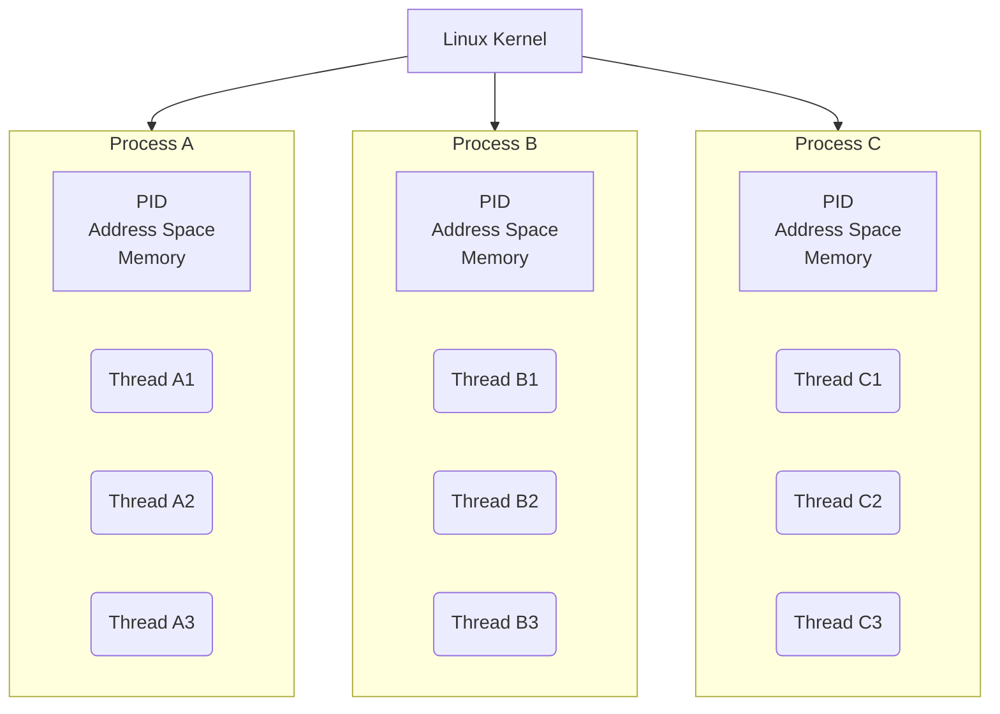
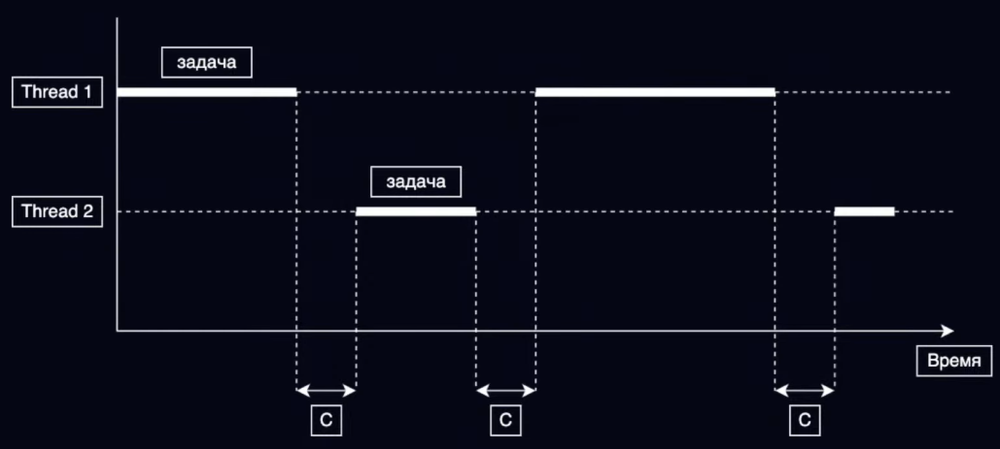
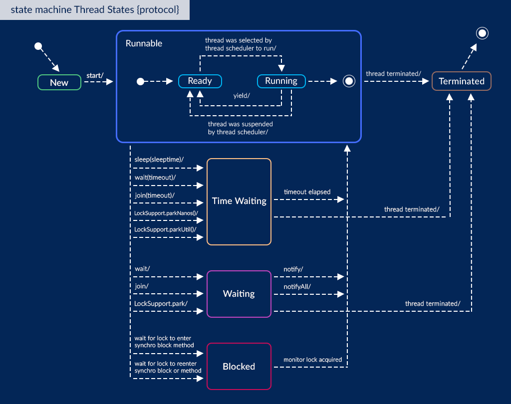
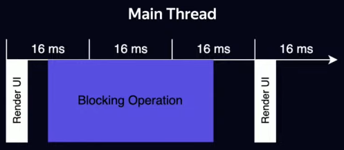

# Concurrency

- [ШМР - Потоки и асинхронность](https://www.youtube.com/watch?v=e_NOYbGwI-g)
- [Oracle - Concurrency Tutorial](https://docs.oracle.com/javase/tutorial/essential/concurrency/index.html)
- [Java - Chapter 17. Threads and Locks](https://docs.oracle.com/javase/specs/jls/se8/html/jls-17.html)
- [Jenkov - Java Concurrency and Multithreading Tutorial](https://jenkov.com/tutorials/java-concurrency/index.html)
- [Kotlin - Asynchronous programming techniques](https://kotlinlang.org/docs/async-programming.html)

## Process and Thread

In concurrent programming, there are two basic units of execution: **<u>processes</u>** and **<u>threads</u>**.

- **<u>Process</u>** - an application instance during runtime.
	- Has a self-contained **execution environment**.
	- Has a complete, private set of basic run-time resources: its own **memory space**.
	- To facilitate communication between processes, most OSs support _Inter Process Communication_ (IPC) resources, such as *pipes* and *sockets*.
	- Most implementations of the JVM run as a single process. A Java application can create additional processes using a [`ProcessBuilder`](https://docs.oracle.com/javase/8/docs/api/java/lang/ProcessBuilder.html) object.
- **<u>Thread</u>** - A set of instructions, which are executed consecutively
	- Also provide an execution environment
	- Sometimes called _lightweight processes_: requires fewer resources than creating a new process.
	- Threads exist within a process — every process has at least one. Threads share the process's resources, including memory and open files.
	- Every application has at least one thread: _main thread_, that has the ability to create additional threads.






## Java Thread

Each thread is associated with an instance of the class [`Thread`](https://docs.oracle.com/javase/8/docs/api/java/lang/Thread.html).

```kotlin
fun main(){
	val thread = Thread {
		val threadName = Thread.currentThread().name
		println("Hello from $threadName!")
	}
//  thread.run() // will not create a new Thread, but execute run() of passed Runnable
	thread.start()
}
```

Kotlin's [`fun thread(){ }`](https://kotlinlang.org/api/latest/jvm/stdlib/kotlin.concurrent/thread.html)

```kotlin
fun main(){
	val thread = thread {
		val threadName = Thread.currentThread().name
		println("Hello from $threadName!")
	} // starting created Thread
}
```

### Lifecycle

- https://www.baeldung.com/java-thread-lifecycle
- https://javarush.com/quests/lectures/questmultithreading.level05.lecture03



```kotlin
enum class State {
	NEW,
	RUNNABLE,
	BLOCKED,
	WAITING,
	TIMED_WAITING,
	TERMINATED
}
Thread.currentThread().state: Thread.State
```

1. **NEW** - a newly created thread that has not yet started the execution
```kotlin
val thread = Thread{}
println(thread.state) // NEW
```
2. **RUNNABLE** - either running or ready for execution but it’s waiting for resource allocation
```kotlin
val thread = thread{}
println(thread.state) // RUNNABLE
```
3. **BLOCKED** - waiting to acquire a monitor lock to enter or re-enter a synchronized block/method
```kotlin
val lock = Any()
thread { synchronized(lock){ Thread.sleep(10) } }
val thread = thread{ synchronized(lock){} }
Thread.sleep(1) // just to make thread pass RUNNABLE state
println(thread.state) // BLOCKED
```
4. **WAITING** - waiting for some other thread to perform a particular action without any time limit
```kotlin
val threadA = thread { Thread.sleep(10) }  
val threadB = thread{ threadA.join() }  
Thread.sleep(1) // just to make thread pass RUNNABLE state
println(threadB.state) // WAITING
```
5. **TIMED_WAITING** - waiting for some other thread to perform a specific action for a specified period
```kotlin
val thread = thread{Thread.sleep(10)}  
Thread.sleep(1) // just to make thread pass RUNNABLE state  
println(thread.state) // TIMED_WAITING
```
6. **TERMINATED** - has completed its execution
```kotlin
val thread = thread{}  
thread.join()  
println(thread.state) // TERMINATED
```

### Thread control methods

#### Sleep

- https://docs.oracle.com/javase/tutorial/essential/concurrency/sleep.html
- https://docs.oracle.com/javase/7/docs/api/java/lang/Thread.html

`Thread.sleep` causes the current thread to suspend execution for a specified period.

```kotlin
println("1. Main thread started") // 1  
thread {  
    println("2. Thread started") // 3  
    Thread.sleep(200)  
    println("3. Thread finished") // 4  
}  
println("4. Main thread continues") // 2  
Thread.sleep(100)  
println("5. Main thread finished") // 5
```
```output
1. Main thread started
4. Main thread continues
2. Thread started
5. Main thread finished
3. Thread finished
```

#### Join

- https://www.baeldung.com/java-thread-join
- https://docs.oracle.com/en/java/javase/21/docs/api/java.base/java/lang/Thread.html#join()

Waits for this thread to terminate.
Throws: `[InterruptedException]` - if any thread has interrupted the current thread. The _interrupted status_ of the current thread is cleared when this exception is thrown.

When we invoke the `join()` method on a thread, the *calling thread* goes into a waiting state. It remains in a waiting state until the *referenced thread* terminates.

`join()` creates a ***happens-before** relationship*.

```kotlin
println("1. Main thread started") // 1
val thread = thread {
	println("2. Thread started") // 3
	Thread.sleep(300)
	println("3. Thread finished") // 6
}
println("4. Joining thread with timeout") // 2
thread.join(100) // calling thread: main; referenced thread: thread
println("5. Joining timeout exceeded") // 4
Thread.sleep(100)
println("6. Joining thread without timeout") // 5
thread.join() // calling thread: main; referenced thread: thread
println("7. Main thread finished") // 7
```
```output
1. Main thread started
4. Joining thread with timeout
2. Thread started
5. Joining timeout exceeded
6. Joining thread without timeout
3. Thread finished
7. Main thread finished
```


#### Wait & Notify

- https://www.baeldung.com/java-wait-notify
- https://www.baeldung.com/cs/monitor
- https://docs.oracle.com/en/java/javase/21/docs/api/java.base/java/lang/Object.html#notify()
- https://javarush.com/groups/posts/4145-kofe-breyk-237-poljhzovateljhskaja-sinkhronizacija-v-java-s-ispoljhzovaniem-vstroennihkh-blokir

- `wait()` - Causes the current thread to wait until it is awakened, typically by being _notified_ or _interrupted_.
- `wait(timeout)` - The same as `wait()`, but waiting until a certain amount of real time has elapsed.
- `notify()` - Wakes up a single thread that is waiting on this object's monitor. If any threads are waiting on this object, one of them is chosen to be awakened (depends on JVM implementation).
- `notifyAll()` - Wakes up all threads that are waiting on this object's monitor.

These methods should only be called by a thread that is the owner of this object's *monitor*. A thread becomes the owner of the object's *monitor* in one of three ways:

- By executing a synchronized instance method of that object.
- By executing the body of a `synchronized` statement that synchronizes on the object.
- For objects of type `Class,` by executing a static synchronized method of that class.

Only one thread at a time can own an object's monitor.

**`wait()` orders the calling thread to release the monitor and go to sleep until some other thread enters this monitor and calls `notify()`**.  Also, `notify()` wakes up **the first thread** that called `wait()` on the specific object.

https://ru.stackoverflow.com/questions/853006/kotlin-wait-and-notify
> In Kotlin, the `Any` class does not have `wait()`, `notify()`, `notifyAll()`. This is like a hint of what needs to be done differently.

https://stackoverflow.com/questions/35520583/why-are-there-no-concurrency-keywords-in-kotlin
> You can use wait and notify on Java Objects

https://kotlinlang.org/docs/java-interop.html#wait-notify
> Methods `wait()` and `notify()` are not available on references of type `Any`. Their usage is generally discouraged in favor of `java.util.concurrent`. If you really need to call these methods, you can cast to `java.lang.Object`:
```kotlin
(foo as java.lang.Object).wait()
```


```kotlin
val monitor = Any()  
thread {  
    println("A: Started")  
    Thread.sleep(25)  
    println("A: Finishing work")  
    synchronized(monitor){  
        println("A: Notifying")  
        (monitor as java.lang.Object).notify()  
        println("A: Notification sent, but we need to release monitor")  
        Thread.sleep(10)  
        println("A: Releasing monitor")  
    }
    Thread.sleep(10)
    println("A: Finished")  
}  
thread{  
    println("B: Started")  
    synchronized(monitor){  
        println("B: Waiting")  
        (monitor as java.lang.Object).wait() // Other Threads can enter synchronized(monitor){} because current Thread is waiting  
        println("B: Notification received")  
        Thread.sleep(10)  
        println("B: Releasing monitor")  
    }
    Thread.sleep(10)
    println("B: Finished")  
}
```
```output
A: Started
B: Started
B: Waiting
A: Finishing work
A: Notifying
A: Notification sent, but we need to release monitor
A: Releasing monitor
B: Notification received
B: Releasing monitor
A: Finished
B: Finished
```

##### BlockingQueue with wait & notify

https://stackoverflow.com/questions/2536692/a-simple-scenario-using-wait-and-notify-in-java

```java
public class BlockingQueue<T> {
    private Queue<T> queue = new LinkedList<T>();
    private int capacity;
    public BlockingQueue(int capacity) {
        this.capacity = capacity;
    }
    public synchronized void offer(T element) throws InterruptedException {
	    // waiting until free space in queue
        while(queue.size() >= capacity) wait(); // monitor is this
        queue.offer(element);
        notify(); // notifyAll() for multiple producer/consumer threads
    }
    public synchronized T poll() throws InterruptedException {
	    // waiting until any element in queue
        while(queue.isEmpty()) wait();
        T item = queue.poll();
        notify(); // notifyAll() for multiple producer/consumer threads
        return item;
    }
}
```

### Syncronization


#### Deadlock

- https://jenkov.com/tutorials/java-concurrency/deadlock.html
- https://jenkov.com/tutorials/java-concurrency/deadlock-prevention.html
- 

```kotlin
fun deadlock() {  
    val leftFork = Any()  
    val rightFork = Any()  
    val mathematicianA = thread {  
        println("A: taking leftFork")  
        synchronized(leftFork){  
            println("A: leftFork taken")  
            Thread.sleep(10)  
            println("A: taking rightFork")  
            synchronized(rightFork){ // DEADLOCK!  
                // Eating spaghetti
            } // free second fork  
        } // free first fork  
    }  
    val mathematicianB = thread {
        println("B: taking rightFork")
        synchronized(rightFork){
            println("B: rightFork taken")
            Thread.sleep(10)
            println("B: taking leftFork")
            synchronized(leftFork){ // DEADLOCK!
                // Eating spaghetti
            } // free second fork
        } // free first fork
    }  
}
```
```output
A: taking leftFork
A: leftFork taken
B: taking rightFork
B: rightFork taken
A: taking rightFork
B: taking leftFork
```
## Android


