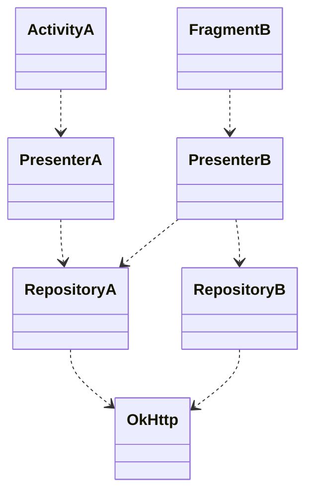
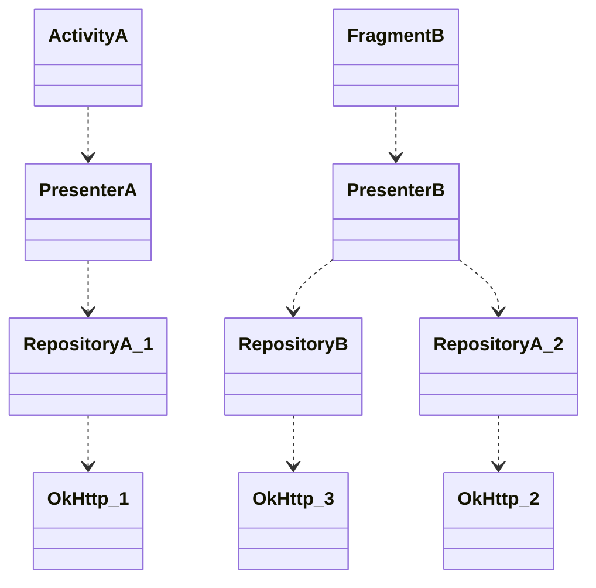

# Dependency Injection (DI)

- [DI: Google Guide](https://developer.android.com/training/dependency-injection)
- [DI: Yandex Лекция на ШМР](https://www.youtube.com/watch?v=yGiCNunSVN8)

**<u>Dependency injection (DI)</u>** is a technique widely used in programming and well suited to Android development. By following the principles of DI, you lay the groundwork for good app architecture.

Implementing dependency injection provides you with the following advantages:

- Decreasing of code coupling
- Reusability of code
- Ease of refactoring
- Ease of testing

## Problem

Some object has a dependency:

```kotlin
class Car {
	private val engine // need to be initialized
}
```

We need to provide this dependency somehow:

1. The class constructs the dependency it needs. This is **hard dependency**:
```kotlin
class Car {
	private val engine = Engine()
}
```
> (-) Car and Engine are **tightly coupled** - no subclasses or alternative implementations can easily be used. Difficult testing.

2. Grab it from somewhere else.
```kotlin
class Car {
	private val engine = API.getEngine()
}
```

3. Have it supplied as a parameter.
```kotlin
class Car(private val engine: Engine) { }
```
> (+) Reusability of Car. You can pass in different implementations of Engine to Car. Easy testing of Car. You can pass in test doubles to test your different scenarios.

There are two major ways to do DI:

- **Constructor Injection**. You pass the dependencies of a class to its constructor.
- **Field Injection (or Setter Injection)**. Certain framework classes (such as Android Activities and Fragments) are instantiated by the system, so constructor injection is not possible. With field injection, dependencies are instantiated after the class is created.

### Relationships

https://medium.com/@bindubc/association-aggregation-and-composition-in-oops-8d260854a446

| Type    | Description                                                                                                         |
| ------- | ------------------------------------------------------------------------------------------------------------------- |
| `<\|--` | Inheritance - "is a" relationship                                                                                   |
| `*--`   | Composition - child cannot exist independently of the parent, dependent lifecycle "part-of" relationship.           |
| `o--`   | Aggregation - child can exist independently of the parent, own lifecycle, "has-a" relationship.                     |
| `-->`   | Association - objects created and destroyed independently. Composition and Aggregation are subforms of Association. |
| `--`    | Link (Solid)                                                                                                        |
| `..>`   | Dependency                                                                                                          |
| `..\|>` | Realization (Implementation)                                                                                        |
| `..`    | Link (Dashed)                                                                                                       |

## Manual DI

Target dependency graph looks like:


### Step 1: Hard Dependencies

```kotlin
class ActivityA: Activity() {
	private val presenter = PresenterA()
}
class FragmentB: Fragment() {
	private val presenter = PresenterB()
}
class PresenterA {
	private val героA = RepositoryA()
}
class PresenterB {
	private val героA = RepositoryA()
	private val героB = RepositoryB()
}
class RepositoryA {
	private val client = OkHttpClient()
}
class RepositoryB {
	private val client = OkHttpClient()
}
```

Result dependency graph looks like:



- No code reusability
- Objects tightly coupled
- Hard testing

### Step 2: Constructor Injection

```kotlin
class ActivityA(/*constructor must be empty!*/): Activity() {
	private val client = OkHttpClient()
	private val rеро = RepositoryA(client)
	private val presenter = PresenterA(rеро)
}
class FragmentB(/*constructor must be empty!*/): Fragment() {
	private val client = OkHttpClient()
	private val rероA = RepositoryA(client)
	private val rероB = RepositoryB(client)
	private val presenter = PresenterB(rероA, rероB)
}
class PresenterA(
	private val repoA
) {}
class PresenterB(
	private val repoA
	private val repoB
) {}
class RepositoryA(private val client) {}
class RepositoryB(private val client) {}
```

### Step 3: Attaching to Application, Activity, Fragment lifecycle

```kotlin
class MyApplication: Application() {
	// This is DI:
	private val client = OkHttpClient()
	private val rероA = RepositoryA(client)
	private val rероB = RepositoryB(client)
	private val presenterA = PresenterA(rероA)
	private val presenterB = PresenterB(rероA, rероB)
}
class ActivityA: Activity() {
	private lateinit var presenterA
	private lateinit var presenterB
	override fun onCreate(...){
		...
		presenterA = (application as MyApplication).presenterA
		presenterB = (application as MyApplication).presenterB
	}
}
class FragmentB: Fragment() {
	private lateinit var presenter
	override fun onCreate(...){
		...
		presenter = (activity as ActivityA).presenterB
	}
}
class PresenterA(
	private val repoA
) {}
class PresenterB(
	private val repoA
	private val repoB
) {}
class RepositoryA(private val client) {}
class RepositoryB(private val client) {}
```

### Step 4: Components

```kotlin
class AppComponent {
	val client by lazy{ OkHttpClient() }
	fun activityAComponent() = ActivityAComponent(this)
}
class ActivityAComponent(private val appComponent: AppComponent) {
	private val rероA by lazy{ RepositoryA(appComponent.client) }
	val rероB by lazy{ RepositoryB(appComponent.client) }
	private val presenterA by lazy{ PresenterA(rероA) }
	fun presenter() = presenterA
	fun fragmentBComponent() = FragmentBComponent(this)
}
class FragmentBComponent(private val activityAComponent: ActivityAComponent) {
	private val presenterB by lazy{ PresenterB(activityAComponent.rероB) }
	fun presenter() = presenterB
}

class MyApplication: Application() {
	val component = AppComponent()
}
class ActivityA: Activity() {
	private lateinit var presenter
	override fun onCreate(...){
		...
		presenter = (application as MyApplication).presenterA
	}
}
class FragmentB: Fragment() {
	private lateinit var presenter
	override fun onCreate(...){
		...
		presenter = (application as MyApplication).presenterB
	}
}
class PresenterA(
	private val repoA
) {}
class PresenterB(
	private val repoA
	private val repoB
) {}
class RepositoryA(private val client) {}
class RepositoryB(private val client) {}
```