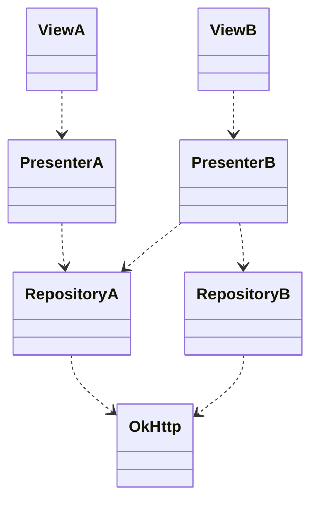

# Dependency Injection (DI)

- [DI: Google Guide](https://developer.android.com/training/dependency-injection)
- [DI: Yandex Лекция на ШМР](https://www.youtube.com/watch?v=yGiCNunSVN8)

## Manual


```kotlin
class MyFragment: Fragment() {
	private val presenter = Presenter()
	// ... use presenter
}
class Presenter {
	private val геро = Repository()
	// ... use геро
}
class Repository {
	private vaI client = OkHttpClient()
	// ... use client
}
```

